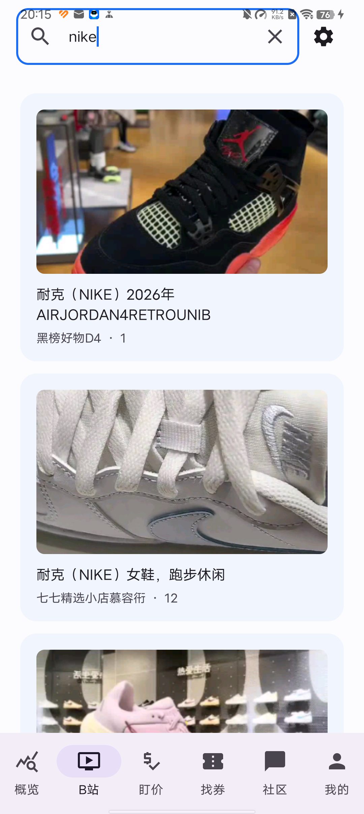
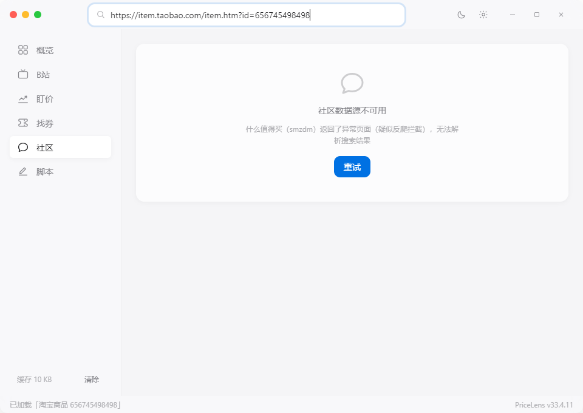
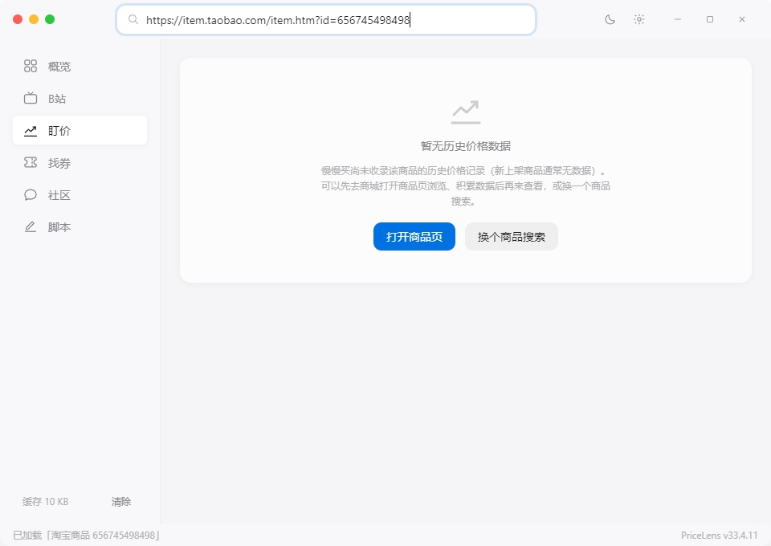
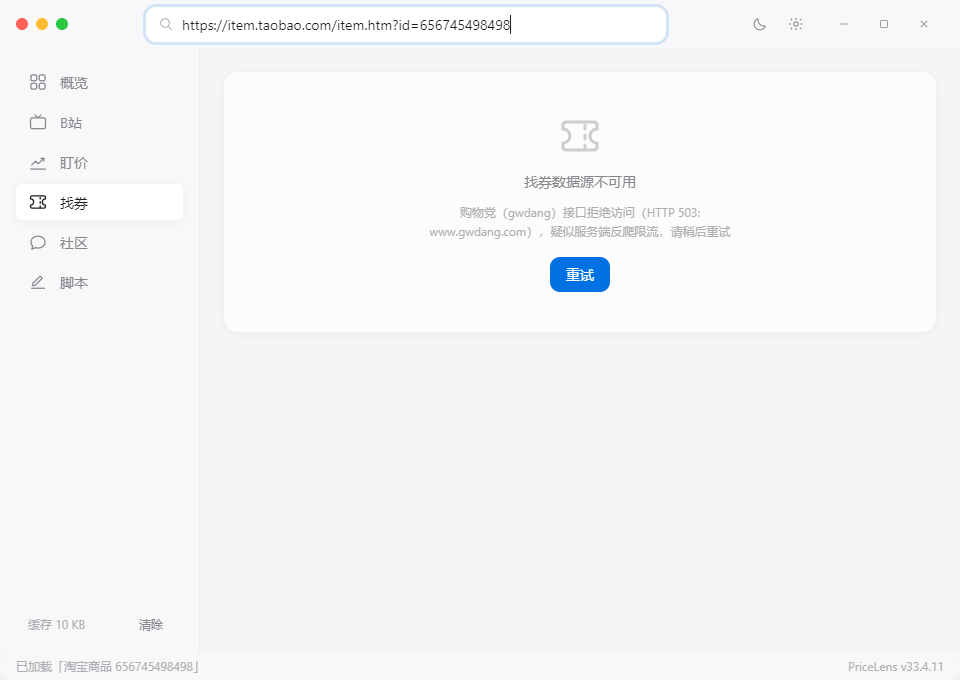

# PriceLens — Minimal Price-Comparison Assistant

[简体中文](README.md) | [English](README.en.md)

> **Dual platform** · **Forever free** · **Local-first** · **MIT License**
> Android (accessibility-powered) + Windows (Electron) · Author: **Mo**
> Version: Android v2.5.1 / Desktop v2.1.0

[](https://opensource.org/licenses/MIT)
[](https://github.com/wuliao00/PriceLens/releases)

PriceLens brings price comparison back to basics: open a product page and instantly
see cross-store price history, coupons, and real community feedback —
no ads, no tracking, no data leaving your machine.

## Features

- **Price detection**: JD / Taobao / PDD product pages via Android accessibility
  service; web crawling on desktop.
- **Price history**: min/max markers, current-price pulse, promo shading,
  "price-then-drop" detection (>= 7-day average x 1.10).
- **Community check**: Bilibili review videos with "sponsor / hype" flags,
  SMZDM worth-it gauge.
- **Coupons**: auto-detected coupons with one-click copy.
- **Price watch**: background polling every 30 minutes, system notification on
  target hit (Android WorkManager / desktop tray-resident).
- **Custom scripts**: read-only built-ins + user scripts (Android via Shizuku
  ADB shell, desktop via PowerShell, 120s timeout, 64KB size cap).
- **Privacy first**: zero analytics, zero upload; local Room + TLRU cache
  (Android) and local JSON cache (desktop).

## Screenshots

| Bilibili reviews | Community (Shihuo) | Price chart | Coupons |
|------------------|--------------------|-------------|---------|
|  |  |  |  |

## Installation

Download signed builds from
[GitHub Releases](https://github.com/wuliao00/PriceLens/releases):

- **Android**: `PriceLens_v2.5.1.apk` (Android 8.0+)
- **Windows**: NSIS installer or portable ZIP (Windows 10/11 x64, Node not required)

## Build from Source

### Android

```bash
git clone https://github.com/wuliao00/PriceLens.git
cd PriceLens
echo "sdk.dir=<your Android SDK path>" > local.properties
./gradlew :app:assembleDebug          # debug build, no signing needed
./gradlew test ktlintCheck            # unit tests + style gate
```

Release signing: append `PRICLENS_STORE_FILE` / `PRICLENS_STORE_PASSWORD` /
`PRICLENS_KEY_ALIAS` / `PRICLENS_KEY_PASSWORD` to `local.properties`, then run
`./gradlew :app:assembleRelease`.

### Desktop (Electron 33 + native JS + Vite)

```bash
cd desktop
npm install        # also generates build/icon.ico via postinstall
npm run dev        # dev mode (Electron + Vite hot reload)
npm run lint       # syntax gate (node --check)
npm run build      # NSIS installer + portable ZIP into dist/
```

Requirements: Node 18+. Optional: `npx playwright install chromium` for
JS-rendered pages (graceful fallback without it).

## Tech Stack

- **Android**: Kotlin 2.0, Jetpack Compose, Hilt, Room, WorkManager, Coil,
  OkHttp, Shizuku (optional, ADB-level automation).
- **Desktop**: Electron 33, vanilla JS, Vite, undici, electron-builder.

## Crawler Discipline (shared by both platforms)

```text
<= 1 req / 3s per domain
<= 3 concurrent domains
10s timeout, 1 retry
UA rotation (5)
403 -> 5min circuit breaker
```

## Documentation

- [Changelog](CHANGELOG.md) · [API](docs/API.md) · [Development](docs/DEVELOPMENT.md)
- [Privacy](PRIVACY.md) · [Security](SECURITY.md) · [License](LICENSE)

## License

MIT License. Free forever — no paid tier, no ads, no tracking.
Keep this notice and the LICENSE file when redistributing.
