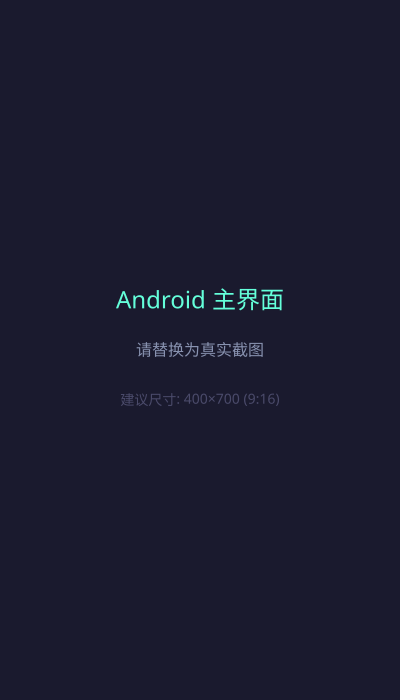
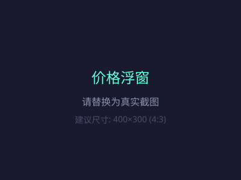
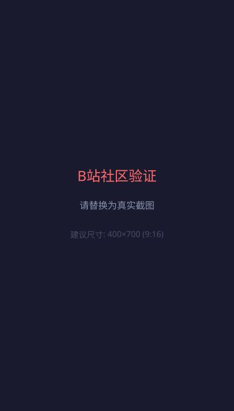
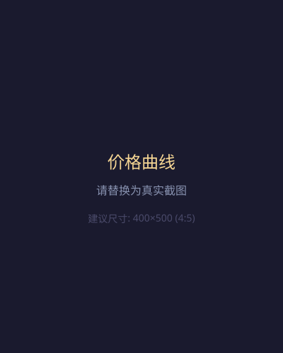
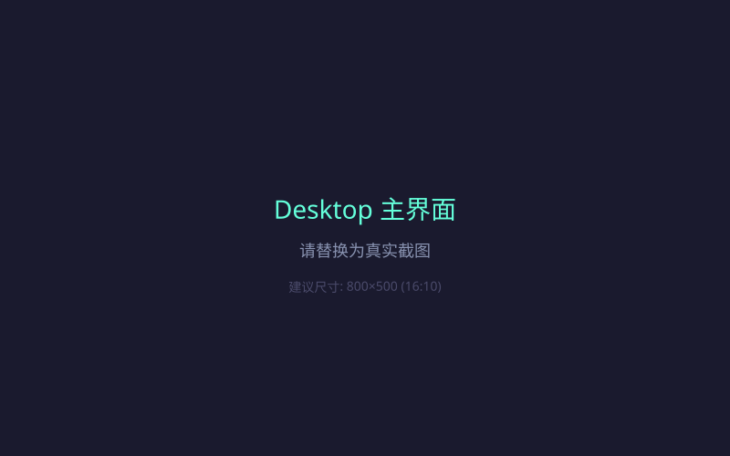
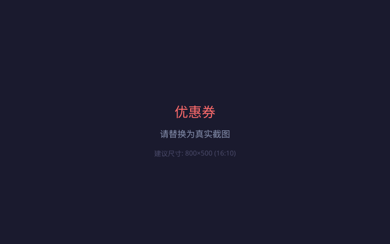
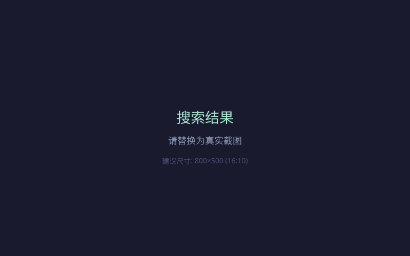

# PriceLens — 极简全网比价助手

> **双端开源** · **永久免费** · **本地优先** · **MIT License**  
> Android 无障碍增强版 + Windows Electron 便携版  
> 作者：**莫** | 版本：Android v2.3.0 / Desktop v2.0.0

[](https://opensource.org/licenses/MIT)
[](https://github.com/wuliao00/PriceLens/releases)
[](https://github.com/wuliao00/PriceLens/releases)
[](https://kotlinlang.org/)
[](https://developer.android.com/jetpack/compose)
[](https://www.electronjs.org/)
[](https://vitejs.dev/)
[](https://github.com/wuliao00/PriceLens/releases)
[](https://github.com/wuliao00/PriceLens/stargazers)

---

## 🎯 一句话介绍

**PriceLens 让比价回归本质：打开商品页即时看到全网历史价格、优惠券、社区真实评价——无广告、无埋点、数据不出本机。**

---

## 📱 支持平台对比

| 功能 | Android | Windows 桌面端 |
|------|---------|----------------|
| **京东/淘宝/拼多多** 商品页自动读价 | ✅ 无障碍服务 | ✅ 网页解析 |
| **哔哩哔哩** 翻车/推荐视频识别 | ✅ | ✅ |
| **什么值得买/慢慢买/购物党** 爬取 | ✅ | ✅ |
| **咕咚/Keep** 运动装备比价 | ✅ | ✅ |
| 价格历史曲线（最低/最高/大促标注） | ✅ | ✅ |
| 优惠券一键复制 | ✅ | ✅ |
| 盯价后台任务（30min 周期） | ✅ WorkManager | ⏳ 计划中 |
| 自定义脚本 | ✅ Shizuku ADB | ⏳ 计划中 |
| 数据存储 | 本机 Room + TLRU | 本机 SQLite + IndexedDB |
| 分发方式 | APK（需签名） | ZIP 便携版（免安装） |

---

## 📸 界面预览

> 📷 **建议替换为真实截图/GIF**（将图片放入 `assets/` 目录并更新下方路径）

### Android 端

| 主界面 | 价格浮窗 | B站社区验证 | 价格曲线 |
|--------|----------|-------------|----------|
|  |  |  |  |

### Windows 桌面端

| 主界面 | 价格历史 | 优惠券 | 搜索结果 |
|--------|----------|--------|----------|
|  |  |  |  |

---

## 🚀 快速开始

### 国内加速下载（推荐）

| 平台 | 蓝奏云 | 夸克网盘 | GitHub Release |
|------|--------|----------|----------------|
| **Android** | [PriceLens比价助手_v2.3_免费开源_作者莫.apk](https://www.ilanzou.com/s/K1DKLuCg) | [PriceLens比价助手_v2.3_免费开源_作者莫.apk](https://pan.quark.cn/s/33e192dc914d?pwd=WWnG) | [Release](https://github.com/wuliao00/PriceLens/releases) |
| **Windows** | [PriceLens-2.0.0-win.zip](https://www.ilanzou.com/s/K1DKLuCg) | [PriceLens-2.0.0-win.zip](https://pan.quark.cn/s/33e192dc914d?pwd=WWnG) | [Release](https://github.com/wuliao00/PriceLens/releases) |

> ⚠️ **蓝奏云无需提取码**，夸克网盘提取码：**WWnG**。两个网盘均为同一文件分享链接。

---

### Android 版（手机端）

**下载**：[Release](https://github.com/wuliao00/PriceLens/releases) → `PriceLens比价助手_v2.3_免费开源_作者莫.apk`

**源码构建**：
```bash
# 1. 克隆仓库
git clone https://github.com/wuliao00/PriceLens.git
cd PriceLens

# 2. 配置 SDK
echo "sdk.dir=<你的 Android SDK 路径>" > local.properties

# 3. 调试包（无需签名）
./gradlew :app:assembleDebug

# 4. 签名 Release 包（需在 local.properties 追加签名信息）
# PRICLENS_STORE_FILE=app/pricelens.keystore
# PRICLENS_STORE_PASSWORD=****
# PRICLENS_KEY_ALIAS=pricelens
# PRICLENS_KEY_PASSWORD=****
./gradlew :app:assembleRelease
```

> 🔐 **安全**：`local.properties`、`*.keystore` 已在 `.gitignore`，仓库中**无任何密码**。

---

### Windows 版（桌面端）

**下载**：见上方 [国内加速下载](#国内加速下载推荐) 表格 → `PriceLens-2.0.0-win.zip`（116 MB，解压即用）

**源码构建**：
```bash
cd desktop

# 1. 安装依赖（需 Node 18+，推荐使用 nvm 管理版本）
npm install          # 首次安装依赖，自动生成图标

# 2. 开发模式（热重载）
npm run dev          # Electron + Vite 双进程热重载
npm run dev:web      # 仅启动 Vite 开发服务器（http://localhost:5173）

# 3. 生成应用图标（已在 postinstall 自动运行，也可手动）
npm run icon         # 生成 build/icon.ico (256×256 PNG-in-ICO)

# 4. 打包分发版（仅 ZIP 便携版，避免 NSIS 兼容性问题）
npm run build        # 产出 dist/PriceLens-<version>-win.zip (116 MB)

# 5. 可选：安装 Playwright 用于动态渲染页面爬取
# npm install playwright
# npx playwright install chromium
```

**构建产物说明**：
- `dist/win-unpacked/` — 解压后的应用目录（可直接运行 `PriceLens.exe`）
- `dist/PriceLens-2.0.0-win.zip` — 便携版分发包，解压即用，无需安装

**配置文件**：
- `electron-builder.yml` — 仅打包 `zip` 目标，`asar: true`，排除 `node_modules/*/test*` 等体积优化
- `vite.config.js` — 渲染进程构建配置，`base: './'` 保证相对路径可在 ZIP 内运行
- `package.json` — `productName: "PriceLens"`、`version: "2.0.0"` 同步至安装包元数据

> 💡 桌面端爬虫与 Android 端**同源同策略**，解析器复用 `desktop/src/main/crawlers/`。  
> 💡 `optionalDependencies` 中的 `playwright` 仅用于需要 JS 渲染的页面（如 SPA 商品页），未安装时自动降级为静态解析。

---

## ✨ 核心特性（v2.3.0 / v2.0.0）

### 🔍 智能比价
- **全平台覆盖**：京东、淘宝、拼多多、哔哩哔哩、什么值得买、慢慢买、购物党、咕咚、Keep
- **实时读价**：Android 端无障碍服务监听商品页变化；桌面端后台爬虫定时抓取
- **价格曲线**：最低/最高虚线标注、当前价脉冲点、大促灰色区间、先涨后降检测（≥7日均价×1.10）

### 🎯 精准决策
- **B站社区验证**：翻车视频红色标记、推荐视频绿色标记、关键词高亮
- **值得买值/不值进度条**：直观判断商品口碑
- **优惠券一键复制**：自动识别可用券，Snackbar 提示复制成功

### ⚡ 极致性能
- **60fps 动画铁律**：`graphicsLayer` + `drawBehind`，时长 ≤ 350ms，无 bounce
- **分级缓存 ≤ 30MB**：L1 内存 TLRU + L2 Room + Coil + OkHttp 精细预算控制
- **反爬规范**：同域名限流、UA 轮换、熔断机制，保护目标站点

### 🎨 Material You 设计
- Android 12+ 动态取色，低版本回退品牌蓝
- 暗色模式跟随系统，圆角 16-12-8、间距 4dp 基准
- 卡片无投影无粗边框，靠 tonalElevation 色差分层

### 🛡️ 隐私优先
- **零埋点、零上报**：所有数据仅存本机
- **权限最小化**：Android 仅需无障碍 + 悬浮窗 + 通知（均可一键关闭）
- **开源透明**：MIT 协议，欢迎审计

---

## 📁 项目结构

```
PriceLens/
├── app/                              # Android 模块
│   └── src/main/java/com/pricelens/
│       ├── accessibility/            # 无障碍服务：监听/匹配/浮窗
│       ├── data/
│       │   ├── remote/               # 爬虫：JD/淘宝/PDD/Bili/值得买/慢慢买
│       │   ├── local/                # Room 数据库 + 实体 + DAO
│       │   ├── cache/                # TLRU 缓存 + 清理 Worker
│       │   └── repository/           # 三级缓存编排
│       ├── ui/
│       │   ├── main/                 # MainActivity / ViewModel
│       │   ├── overview|bilibili|price|coupon|community/
│       │   ├── components/           # SearchBar / PriceCard / PriceOverlay / Shimmer
│       │   └── theme/                # Material You 主题
│       ├── worker/                   # 盯价 Worker
│       ├── util/                     # RateLimiter / WbiSigner / PriceFormatter
│       └── di/                       # Hilt 依赖注入
│
├── desktop/                          # Electron 桌面端
│   ├── src/main/
│   │   ├── crawlers/                 # 同源爬虫：jd/gwdang/bili/smzdm/manmanbuy
│   │   ├── cache/                    # SQLite + LRU/TTL 缓存
│   │   ├── ipc-handlers.js           # 主渲染进程通信
│   │   └── preload.js                # 安全预加载脚本
│   ├── src/renderer/
│   │   ├── js/components/            # UI 组件：价格图表/优惠券/搜索/骨架屏
│   │   ├── css/                      # CSS 变量设计系统
│   │   └── index.html
│   ├── electron-builder.yml          # 仅 zip 便携版
│   └── package.json
│
├── build.gradle.kts
├── settings.gradle.kts
├── gradle.properties
├── LICENSE
├── README.md                         # 本文件
└── RELEASE_NOTES_v2.3.0.md           # 详细发布说明
```

---

## 🔧 爬虫规范（双端共用）

```
同域名 ≤ 1 req/3s
并发域名 ≤ 3
超时 10s 重试 1 次
UA 轮换 ×5 池
403 熔断 5min
```
> 实现位置：Android → `util/RateLimiter.kt` + `data/remote/ApiClient.kt`  
> Desktop → `desktop/src/main/utils/rate-limiter.js` + `http-client.js`

---

## 🧪 验收清单（对照优化文档 §11）

- [x] 无障碍开启后打开京东商品页自动弹浮窗（价格/商品名/按钮）
- [x] 浮窗不遮挡操作、可拖动、可关闭、15s 自动消失
- [x] B站"翻车"红色 Chip / "推荐"绿色 Chip
- [x] 价格曲线：最低/最高虚线 + 当前脉冲点 + 大促灰线
- [x] "先涨后降"检测（≥7日均价 × 1.10）
- [x] 券一键复制 + Snackbar；值得买关键词高亮 + 值/不值进度条
- [x] 动画全部 `graphicsLayer` / `drawBehind` 绘制通道
- [x] 暗色模式跟随系统；后台盯价 30min 周期 + 电量约束
- [x] 缓存分级预算 ≤ 30MB；APK < 20MB（无序列化框架、无图表库）
- [ ] 真机指标（冷启动 < 800ms、60fps、Storage 占用）需实机验证

---

## ⚠️ 已知边界

1. **首次构建需 Android SDK**：本仓库为完整源码，未预编译；请在 Android Studio 中 Sync 后 Build
2. **电商控件 ID 随版本变化**：`PriceNodeMatcher` 三张 ID 表需实机用 Layout Inspector 校准；启发式兜底已保证不至于完全失效
3. **页面解析器随目标站改版需同步调整**：桌面端与 Android 端爬虫同源，改版需双端同步
4. **桌面端盯价/脚本功能计划中**：当前桌面端为查询型工具，后台盯价与自定义脚本仅 Android 端支持

---

## 🤝 贡献指南

我们欢迎所有形式的贡献！

### 提交 PR 流程

1. Fork 本仓库
2. 创建特性分支：`git checkout -b feat/your-feature`
3. 提交变更：`git commit -m "feat: your feature"`
4. 推送分支：`git push origin feat/your-feature`
5. 发起 Pull Request

### 欢迎的贡献方向

| 类型 | 示例 |
|------|------|
| 🐛 **Bug 修复** | 爬虫解析失效、UI 异常、崩溃修复 |
| ✨ **新功能** | 新增电商平台支持、新增对比维度 |
| 🎨 **UI/UX 优化** | 动画优化、暗色模式适配、无障碍改进 |
| ⚡ **性能调优** | 启动速度、内存占用、缓存命中率 |
| 📚 **文档完善** | README、API 文档、使用教程、FAQ |
| 🌐 **国际化** | 多语言支持（i18n） |
| 🔧 **工程化** | CI/CD、自动化测试、依赖更新 |

### 代码规范

- **Kotlin**：遵循 [Android 官方代码风格](https://developer.android.com/kotlin/style-guide)，使用 `ktlint` + `detekt`
- **JavaScript/TypeScript**：ESLint + Prettier（`npm run lint`）
- **提交信息**：遵循 [Conventional Commits](https://www.conventionalcommits.org/) 规范（`feat:`, `fix:`, `docs:`, `chore:`, `refactor:` 等）

> 💡 提交前请运行本地检查：`./gradlew ktlintCheck detekt` (Android) / `npm run lint` (Desktop)

---

## ❓ 常见问题 (FAQ)

### 安装与运行

<details>
<summary><strong>Q: Android APK 安装后打不开 / 闪退？</strong></summary>

A: 请检查：
1. Android 版本 ≥ 8.0 (API 26)
2. 已授权**无障碍服务**（设置 → 无障碍 → PriceLens → 开启）
3. 已授权**悬浮窗权限**（设置 → 应用 → PriceLens → 显示在其他应用上层）
4. 若使用 Shizuku，请确保 Shizuku 服务正在运行
</details>

<details>
<summary><strong>Q: Windows 版解压后双击无反应？</strong></summary>

A: 请检查：
1. Windows 10/11 (x64)，不支持 32 位系统
2. 杀毒软件可能拦截 Electron 应用，请添加信任/白名单
3. 尝试以管理员身份运行 `PriceLens.exe`
4. 查看 `%APPDATA%\PriceLens\logs\` 下的日志排查
</details>

<details>
<summary><strong>Q: 如何验证下载文件完整性？</strong></summary>

A: Release 页面提供 SHA256 校验值，可用以下命令验证：
```bash
# Windows (PowerShell)
Get-FileHash -Algorithm SHA256 PriceLens-2.0.0-win.zip

# Linux/macOS
sha256sum PriceLens-2.0.0-win.zip
```
</details>

### 功能与使用

<details>
<summary><strong>Q: 为什么某些商品页读不到价格？</strong></summary>

A: 电商 App 控件 ID 随版本频繁变更，`PriceNodeMatcher` 采用启发式兜底匹配，但无法保证 100% 覆盖。遇到失效请提 Issue 并提供：
- 目标 App 版本号
- 商品链接/关键词
- Layout Inspector 截图（可选）
</details>

<details>
<summary><strong>Q: 盯价功能如何工作？会消耗电量吗？</strong></summary>

A: Android 端使用 `WorkManager` 周期性任务（默认 30 分钟），受系统电量优化策略影响，实际执行间隔可能延长。已加入电量约束：仅在充电/电量充足时执行网络请求。
</details>

<details>
<summary><strong>Q: 桌面端能否像手机端一样自动盯价？</strong></summary>

A: 目前桌面端为查询型工具，**后台盯价功能计划中**（见 [Issue #盯价](https://github.com/wuliao00/PriceLens/issues)）。可手动点击刷新获取最新价格。
</details>

<details>
<summary><strong>Q: 数据存储在哪里？如何备份/迁移？</strong></summary>

A: 
- **Android**：`/data/data/com.pricelens/databases/` (Room) + 内存缓存
- **Windows**：`%APPDATA%\PriceLens\` (SQLite + IndexedDB)
- 备份：直接复制对应目录即可；跨设备迁移可导出 JSON（功能开发中）
</details>

### 隐私与安全

<details>
<summary><strong>Q: 会上传我的商品浏览记录吗？</strong></summary>

A: **绝不**。PriceLens 遵循 **本地优先** 原则：所有比价数据、搜索历史、盯价任务仅存储在本机，**零埋点、零上报、无账号体系**。详见 [隐私声明](PRIVACY.md)。
</details>

<details>
<summary><strong>Q: 为什么需要无障碍服务 / Shizuku 授权？</strong></summary>

A: 
- **无障碍服务**：读取商品页 UI 树提取价格/标题，实现"打开即比价"
- **Shizuku (ADB 权限)**：一键授权无障碍+悬浮窗+通知，并支持自定义脚本执行
- 权限最小化：仅在用户主动开启时生效，均可随时关闭
</details>

---

## 📚 文档体系

| 文档 | 说明 | 链接 |
|------|------|------|
| **README** | 项目总览、快速开始、功能介绍 | [README.md](README.md) |
| **Release Notes** | 版本更新详细记录 | [RELEASE_NOTES_v2.3.0.md](RELEASE_NOTES_v2.3.0.md) |
| **爬虫规范** | 双端共用的反爬/限流/重试策略 | [README.md#爬虫规范双端共用](README.md#-爬虫规范双端共用) |
| **项目结构** | 代码目录组织与模块职责 | [README.md#项目结构](README.md#-项目结构) |
| **贡献指南** | PR 流程、代码规范、欢迎方向 | [README.md#贡献指南](README.md#-贡献指南) |
| **FAQ** | 常见问题分类解答 | [README.md#常见问题-faq](README.md#-常见问题-faq) |
| **隐私声明** | 数据收集/使用/存储说明 | [PRIVACY.md](PRIVACY.md) |
| **API 文档** | 爬虫接口、缓存层、IPC 通信 | [docs/API.md](docs/API.md)  |
| **开发指南** | 环境搭建、调试技巧、发布流程 | [docs/DEVELOPMENT.md](docs/DEVELOPMENT.md)  |
| **GitHub Wiki** | 社区维护的扩展文档 | [Wiki](https://github.com/wuliao00/PriceLens/wiki) |

> 📝 标记 `*(待创建)*` 的文档欢迎社区贡献，请参考 [贡献指南](README.md#-贡献指南)

---

## 📄 许可证

**MIT License** - 详见 [LICENSE](LICENSE)

> **永久免费承诺**：没有付费版、没有会员、没有内购。  
> 任何收费分发行为均为欺诈。分发请保留本声明与 LICENSE。

---

## 🔗 相关链接

- **GitHub 仓库**：https://github.com/wuliao00/PriceLens
- **Issue 反馈**：https://github.com/wuliao00/PriceLens/issues
- **Release 下载**：https://github.com/wuliao00/PriceLens/releases
- **Release Notes 详细版**：[RELEASE_NOTES_v2.3.0.md](RELEASE_NOTES_v2.3.0.md)
