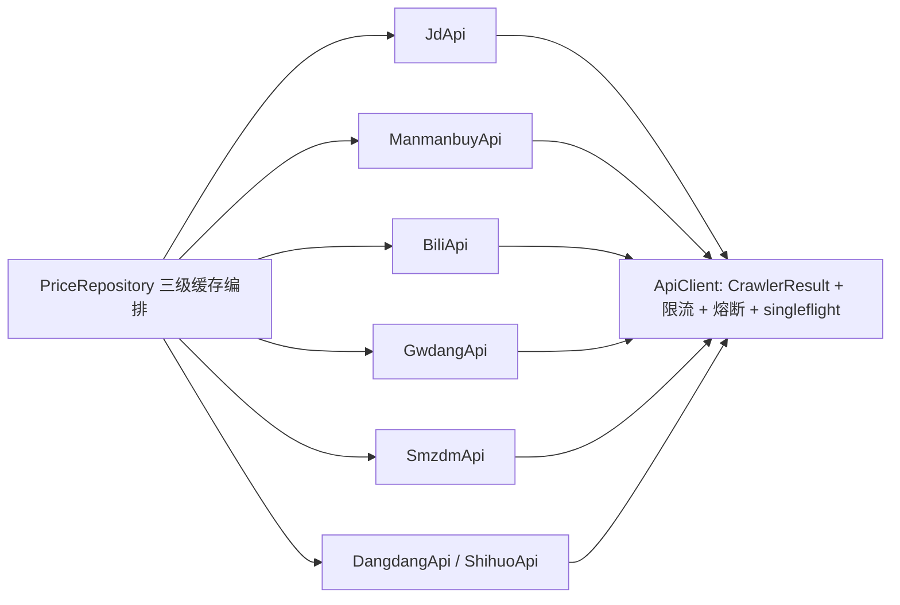
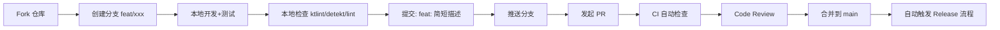

# PriceLens 开发指南

**版本**：v1.1  
**适用版本**：Android v2.5.0+ / Desktop v2.0.0+  
**更新日期**：2026-08-26

---

## 🛠️ 环境搭建

### 通用要求

| 工具 | 版本要求 | 安装方式 |
|------|----------|----------|
| Git | ≥ 2.30 | [git-scm.com](https://git-scm.com/) |
| JDK | 17 (Temurin/OpenJDK) | `winget install EclipseAdoptium.Temurin.17.JDK` |
| Node.js | ≥ 18.18 (LTS) | 推荐 [nvm-windows](https://github.com/coreybutler/nvm-windows) |
| Android Studio | Koala | 2024.1.1+ | [developer.android.com](https://developer.android.com/studio) |
| Gradle | 8.5+ | 随 Android Studio 自动管理 |

### Android 端专用

```bash
# 1. 克隆仓库
git clone https://github.com/wuliao00/PriceLens.git
cd PriceLens

# 2. 配置 Android SDK 路径
echo "sdk.dir=$ANDROID_HOME" > local.properties
# 或 Windows PowerShell:
# "sdk.dir=$env:ANDROID_HOME" | Out-File -Encoding utf8 local.properties

# 3. 验证环境
./gradlew --version
# 应输出：Gradle 8.x, Kotlin 1.9.x, AGP 8.x
```

### Desktop 端专用

```bash
cd desktop

# 1. 安装依赖（含自动生成图标）
npm install

# 2. 验证构建
npm run build
# 产出：dist/PriceLens-2.0.0-win.zip
```

### 可选工具（推荐）

| 工具 | 用途 | 安装 |
|------|------|------|
| `ktlint` | Kotlin 格式化 | `./gradlew ktlintFormat` |
| `detekt` | Kotlin 静态分析 | `./gradlew detekt` |
| `eslint` + `prettier` | JS/TS 格式化 | `npm run lint` |
| `adb` | 真机调试/日志 | Android SDK Platform-Tools |
| `scrcpy` | 手机投屏调试 | `scoop install scrcpy` |

---

## 📦 项目结构详解

```
PriceLens/
├── app/                          # Android 模块
│   ├── build.gradle.kts
│   ├── proguard-rules.pro
│   └── src/
│       ├── main/
│       │   ├── AndroidManifest.xml
│       │   ├── java/com/pricelens/
│       │   │   ├── accessibility/    # 无障碍服务核心
│       │   │   │   ├── PriceMonitorService.kt     # 无障碍服务入口（监听/分发）
│       │   │   │   ├── PriceNodeMatcher.kt        # 关键：控件 ID 匹配表
│       │   │   │   ├── OverlayManager.kt          # 悬浮窗渲染/拖动/自动消失
│       │   │   │   └── PriceEvents.kt             # 事件模型
│       │   │   ├── data/
│       │   │   │   ├── local/        # Room 数据库（v2）
│       │   │   │   │   ├── dao/
│       │   │   │   │   ├── entity/
│       │   │   │   │   └── AppDatabase.kt
│       │   │   │   ├── remote/       # 解析器 + 统一管线（无统一 Crawler 接口）
│       │   │   │   │   ├── ApiClient.kt        # HTTP 管线：限流/熔断/singleflight
│       │   │   │   │   ├── CrawlerResult.kt    # 四态结果（Success/Empty/Blocked/Network）
│       │   │   │   │   ├── JdApi.kt / ManmanbuyApi.kt / BiliApi.kt /
│       │   │   │   │   │   GwdangApi.kt / SmzdmApi.kt / DangdangApi.kt / ShihuoApi.kt
│       │   │   │   ├── cache/        # L1 内存 TLRU + 清理 Worker
│       │   │   │   │   └── TLRUCache.kt
│       │   │   │   └── repository/   # 声明式三级缓存编排 + 源健康降级
│       │   │   │       ├── PriceRepository.kt  # CachedSource 编排（L1→L2→L3）
│       │   │   │       ├── CacheCodec.kt / CacheCodecs.kt  # L2 编解码器
│       │   │   │       └── SourceHealth.kt     # 连续失败降级旧快照
│       │   │   ├── domain/           # 领域层（阶段2 拆出）
│       │   │   │   └── ProductCandidateResolver.kt  # 商品候选解析（多源兜底）
│       │   │   ├── ui/
│       │   │   │   ├── main/         # MainActivity（分片 ViewModel，无上帝 VM）
│       │   │   │   ├── overview/     # 概览/搜索页 + SearchViewModel
│       │   │   │   ├── bilibili/     # B站页
│       │   │   │   ├── price/        # 价格页 + PriceWatchViewModel
│       │   │   │   ├── coupon/       # 优惠券页
│       │   │   │   ├── community/    # 社区页
│       │   │   │   ├── profile/      # 个人页 + ProfileViewModel
│       │   │   │   ├── settings/     # 设置页
│       │   │   │   ├── scripts/      # 自定义脚本页（Shizuku）
│       │   │   │   ├── common/       # AsyncValue 等共享状态模型
│       │   │   │   ├── components/   # 通用组件（AppTopBar/PriceCard/SourceStatusRow…）
│       │   │   │   └── theme/        # 设计令牌：Color/Type/Shape/Motion/Badge
│       │   │   ├── worker/           # PriceCheckWorker（盯价）+ BootCompletedReceiver
│       │   │   ├── util/             # 工具类（RateLimiter/PriceFormatter/LogT…）
│       │   │   └── di/               # Hilt 依赖注入
│       │   └── res/
│       └── test/                     # 单元测试
│
├── desktop/                       # Electron 桌面端
│   ├── package.json
│   ├── electron-builder.yml
│   ├── vite.config.js
│   ├── build/
│   │   ├── generate-icon.js
│   │   ├── icon.ico
│   │   └── installer.nsh
│   ├── src/
│   │   ├── main/                  # 主进程
│   │   │   ├── index.js           # 入口
│   │   │   ├── preload.js         # 预加载脚本
│   │   │   ├── ipc-handlers.js    # IPC 处理器
│   │   │   ├── crawlers/          # 爬虫实现 (与 Android 同源)
│   │   │   │   ├── index.js
│   │   │   │   ├── jd.js
│   │   │   │   ├── bili.js
│   │   │   │   └── ...
│   │   │   ├── cache/             # SQLite + LRU/TTL
│   │   │   │   ├── manager.js
│   │   │   │   └── storage.js
│   │   │   └── utils/
│   │   │       ├── http-client.js
│   │   │       ├── rate-limiter.js
│   │   │       ├── logger.js
│   │   │       └── sanitizer.js
│   │   └── renderer/              # 渲染进程
│   │       ├── index.html
│   │       ├── package.json
│   │       ├── js/
│   │       │   ├── app.js         # 入口
│   │       │   ├── router.js      # 简易路由
│   │       │   ├── components/    # UI 组件
│   │       │   └── utils/
│   │       └── css/
│   │           ├── tokens.css     # 设计令牌
│   │           ├── base.css
│   │           ├── layout.css
│   │           ├── components.css
│   │           └── animations.css
│   └── dist/                      # 构建产物
│
├── build.gradle.kts               # 根构建脚本
├── settings.gradle.kts
├── gradle.properties
├── gradlew / gradlew.bat
├── LICENSE
├── README.md
├── RELEASE_NOTES_v2.3.0.md
├── PRIVACY.md
├── .github/
│   └── dependabot.yml
├── docs/
│   ├── API.md
│   └── DEVELOPMENT.md
└── assets/                        # README 截图目录 (需手动创建)
```

---

## 🔧 核心模块深度解析

### 1. 无障碍服务 - 价格自动读取的核心

**关键文件**：`app/src/main/java/com/pricelens/accessibility/PriceNodeMatcher.kt`

```kotlin
// 三张 ID 表：包名 → 控件 ID 列表
// 1. PRICE_IDS: 价格控件
// 2. TITLE_IDS: 标题控件
// 3. CONTAINER_IDS: 商品页根容器（用于判断是否在商品页）

// 启发式兜底逻辑：
// - 文本含 "¥"/"￥"/"价格"/"现价" 且靠近顶部
// - 兄弟节点含 "原价"/"划线价"
// - 父容器 resource-id 含 "price"/"goods"/"detail"
```

**维护指南**：
1. 电商 App 版本更新后，用 **Layout Inspector** 抓取商品页 UI 树
2. 更新对应平台的 ID 表
3. 运行 `:app:connectedAndroidTest` 验证

### 2. 爬虫管线（解析器 + 统一 HTTP 管线 + 仓储编排）

**Android**：`data/remote/*Api.kt` + `data/remote/ApiClient.kt` + `data/repository/PriceRepository.kt`  
**Desktop**：`desktop/src/main/crawlers/*.js`



> ⚠️ Android 端**没有**统一 `Crawler` 接口（旧文档描述已过时）：
> 各 `*Api` 是无状态解析器，统一能力（限流/熔断/重试/四态结果）全部沉淀在 `ApiClient`，
> 缓存编排声明在 `PriceRepository` 的 `CachedSource`（见 `docs/API.md`）。

**新增平台步骤**：
1. Android 新建 `XxxApi.kt`（参考 `JdApi.kt`），通过构造注入 `ApiClient` 发请求、自行解析
2. 在 `PriceRepository` 增加一个 `kvSource(...)` 声明式缓存方法（选配合适的 `CacheCodec`）
3. Desktop 新增同名 JS 爬虫 → `jd.js` 参考
4. 更新 `RateLimiter` 域名配置
5. 编写测试用例

### 3. 三级缓存架构

```
┌─────────────────────────────────────────┐
│           CacheManager.get(key)         │
└─────────────────┬───────────────────────┘
                  │
        ┌─────────▼─────────┐
        │   L1: 内存 TLRU   │ ← 命中即返回 (ms)
        │   8MB / 500 条    │
        └─────────┬─────────┘
                  │ Miss
        ┌─────────▼─────────┐
        │  L2: Room/SQLite  │ ← 命中回填 L1 (10-50ms)
        │   10MB / 2000 条  │
        └─────────┬─────────┘
                  │ Miss
        ┌─────────▼─────────┐
        │  L3: 网络请求     │ ← 爬虫抓取 (500-3000ms)
        │  OkHttp/undici    │
        └─────────┬─────────┘
                  │
            写入 L2 → 写入 L1 → 返回
```

**缓存键规范**（`PriceRepository` 实际使用）：
```
jd:product:100012345678      → 京东商品详情（L2 结构化 products 表）
mmb:history:<商品页 URL>      → 价格历史（慢慢买）
bili:search:<关键词>          → B站视频搜索
gwd:coupon:<关键词>           → 优惠券（购物党）
smz:search:<关键词>           → 值得买帖子
dd:search:<关键词>            → 当当商品搜索（主源）
sh:search:<关键词>            → 识货商品搜索（兜底源）
```
> 非结构化结果统一落 `cache_entries` 表（L2），商品详情落结构化 `products` 表。

---

## 🧪 测试策略

### 单元测试

```bash
# Android（Linux/macOS）
./gradlew test                    # 单元测试（当前 49 用例全绿）
./gradlew connectedAndroidTest    # 仪器化测试 (需真机/模拟器)
```

```powershell
# Android（Windows PowerShell，注意用 ; 而非 && 分隔命令）
.\gradlew.bat test                # 单元测试
.\gradlew.bat :app:assembleDebug  # 调试包验证
.\gradlew.bat test ktlintCheck :app:assembleDebug  # 提交前完整门禁
```
# Desktop
npm test                          # Jest 单元测试
```

### 关键测试场景

| 模块 | 测试重点 |
|------|----------|
| `PriceNodeMatcher` | 各平台 ID 表匹配率、启发式兜底不误触发 |
| `RateLimiter` | 限流准确性、熔断触发/恢复、并发安全 |
| `TLRUCache` / 三级缓存 | 三级回落、TTL 过期、容量淘汰、并发一致性 |
| `*Api` 解析器 | 解析健壮性、异常 HTML 容错、反爬应对 |
| `AsyncValue` / ViewModel | 状态机流转、Blocked → Error 映射 |

### 集成测试清单

- [ ] 真机安装 Debug APK，开启无障碍 → 打开京东/淘宝/拼多多商品页 → 浮窗弹出
- [ ] 真机安装 Release APK，Shizuku 授权 → 一键开启全套权限
- [ ] Windows 解压 ZIP → 双击运行 → 搜索商品 → 价格曲线渲染
- [ ] 离线模式 → 读取缓存数据 → 价格曲线/历史正常显示
- [ ] 切换暗色模式 → 两端 UI 同步适配
- [ ] 盯价任务创建 → 30min 后 WorkManager 触发 → 通知到达

---

## 🚀 发布流程

### Android 发布

```bash
# 1. 更新版本号
# app/build.gradle.kts: versionCode, versionName
# RELEASE_NOTES_vX.Y.Z.md

# 2. 配置签名 (local.properties)
PRICLENS_STORE_FILE=app/pricelens.keystore
PRICLENS_STORE_PASSWORD=****
PRICLENS_KEY_ALIAS=pricelens
PRICLENS_KEY_PASSWORD=****

# 3. 构建 Release
./gradlew :app:assembleRelease

# 4. 产物
# app/build/outputs/apk/release/app-release.apk

# 5. 上传 GitHub Release
gh release create vX.Y.Z app/build/outputs/apk/release/app-release.apk ...
```

### Desktop 发布

```bash
cd desktop

# 1. 更新版本号
# package.json: version

# 2. 构建
npm run build

# 3. 产物
# dist/PriceLens-X.Y.Z-win.zip

# 4. 上传 GitHub Release
gh release create vX.Y.Z dist/PriceLens-X.Y.Z-win.zip ...
```

### 同步发布检查清单

- [ ] Android `versionCode` 递增，`versionName` 语义化
- [ ] Desktop `package.json` version 同步
- [ ] `RELEASE_NOTES_vX.Y.Z.md` 完整
- [ ] 两端爬虫同步更新（如有平台改版）
- [ ] 截图/GIF 更新到 `assets/`
- [ ] GitHub Release 描述引用 Release Notes
- [ ] 蓝奏云/夸克网盘上传并更新 README 链接

---

## 🐛 调试技巧

### Android 日志分析

```bash
# 过滤 PriceLens 标签
adb logcat -s PriceLens:* *:S

# 无障碍服务事件（v2.5.0 起服务类名为 PriceMonitorService）
adb logcat -s AccessibilityService:V PriceMonitorService:V

# 网络请求（统一 TAG：LogT 封装，日志前缀均为 PriceLens）
adb logcat -s PriceLens:V | findstr "ApiClient\|Api"

# 盯价 Worker（PriceCheckWorker）
adb logcat -s PriceLens:V WorkManager:V
```

### Desktop 日志分析

```bash
# 开发模式查看控制台
npm run dev

# 生产版日志位置
# %APPDATA%\PriceLens\logs\main.log
# %APPDATA%\PriceLens\logs\renderer.log

# 启用详细日志
set DEBUG=pricelens:* && npm run dev
```

### 常见问题排查

| 现象 | 排查方向 |
|------|----------|
| 浮窗不显示 | 1. 无障碍服务是否开启 2. `PriceNodeMatcher` ID 表是否匹配 3. 悬浮窗权限 |
| 价格读取错误 | 1. Layout Inspector 对比控件 ID 2. 启发式兜底逻辑是否误判 |
| 爬虫返回空 | 1. 目标站 HTML 结构变化 2. 反爬拦截 (403/验证码) 3. 选择器失效 |
| 构建失败 | 1. Gradle/AGP 版本兼容 2. 依赖冲突 (`./gradlew dependencyInsight`) 3. Node.js 版本 |

---

## 📈 性能基准

### 目标指标

| 指标 | 目标 | 当前 (v2.3.0) | 测量方法 |
|------|------|---------------|----------|
| 冷启动时间 | < 800ms | ~650ms | `adb shell am start -W` |
| UI 帧率 | 60fps | 58-60fps | `adb shell dumpsys gfxinfo` |
| APK 大小 | < 20MB | ~18MB | `ls -lh app/build/outputs/` |
| 内存占用 | < 100MB | ~75MB | `adb shell dumpsys meminfo` |
| 缓存命中率 | > 80% | ~85% | `CacheManager.stats()` |
| 网络请求成功率 | > 95% | ~97% | 日志统计 |

### 性能分析工具

```bash
# Android Studio Profiler
# - CPU: 采样模式定位热点
# - Memory: 堆转储分析泄漏
# - Network: 请求时间线
# - Energy: 电量消耗

# Macrobenchmark (CI 集成)
./gradlew :app:connectedAndroidTest -Pandroid.testInstrumentationRunnerArguments.class=com.pricelens.benchmark.StartupBenchmark
```

---

## 🔒 安全审计清单

发布前自检：

- [ ] `local.properties`、`*.keystore`、`*.apk` 在 `.gitignore`
- [ ] 签名配置从 `local.properties` 读取，无硬编码密码
- [ ] `AndroidManifest.xml` 无 `android:debuggable="true"`
- [ ] `proguard-rules.pro` 启用混淆，保留关键类
- [ ] 网络请求强制 HTTPS，证书校验不降级
- [ ] 无第三方统计/广告/推送 SDK
- [ ] 敏感数据 (如 Cookie) 仅内存保存，不持久化
- [ ] WebView (如用) 禁用 JavaScript 接口注入风险
- [ ] IPC 通信验证发送方，防止恶意调用

---

## 🤝 贡献工作流



### 分支命名规范

| 类型 | 前缀 | 示例 |
|------|------|------|
| 新功能 | `feat/` | `feat/jd-coupon-support` |
| Bug 修复 | `fix/` | `fix/bili-wbi-sign-fail` |
| 文档 | `docs/` | `docs/api-documentation` |
| 重构 | `refactor/` | `refactor/cache-layer` |
| 性能 | `perf/` | `perf/startup-optimization` |
| 测试 | `test/` | `test/crawler-unit-tests` |
| 维护 | `chore/` | `chore/update-dependencies` |

### 提交信息规范

```
<type>(<scope>): <subject>

<body>

<footer>
```

示例：
```
feat(crawler): 添加拼多多百亿补贴价格解析

- 新增 PddCrawler.parseHundredBillionSubsidy()
- 更新 PriceNodeMatcher PDD_IDS 表
- 增加单元测试覆盖百亿补贴页面

Closes #123
```

---

## 📚 学习资源

### 官方文档
- [Android Developers](https://developer.android.com/) - Jetpack Compose, Room, WorkManager, Hilt
- [Electron](https://www.electronjs.org/docs/latest) - 主进程/渲染进程, IPC, 安全
- [Vite](https://vitejs.dev/guide/) - 构建配置, 环境变量, 插件
- [Kotlin](https://kotlinlang.org/docs/home.html) - 协程, Flow, 密封类

### 架构参考
- [Google 官方架构指南](https://developer.android.com/topic/architecture)
- [Clean Architecture](https://blog.cleancoder.com/uncle-bob/2012/08/13/the-clean-architecture.html)
- [Effective Kotlin](https://github.com/MarcinMoskala/EffectiveKotlin)

### 爬虫/反爬
- [Chrome DevTools Protocol](https://chromedevtools.github.io/devtools-protocol/)
- [Playwright](https://playwright.dev/docs/intro) - 动态渲染页面
- [反爬虫技术对抗](https://github.com/iridium-soda/anti-anti-spider)

---

## 📝 更新日志

| 版本 | 日期 | 变更内容 |
|------|------|----------|
| v1.0 | 2026-08-24 | 初始版本发布 |
| v1.1 | 2026-08-26 | 文件名对齐新架构（PriceMonitorService / 分片 ViewModel / *Api 解析器），补充 Windows 测试命令 |

---

**Happy Coding! 🚀**  
如有疑问，欢迎提 [Issue](https://github.com/wuliao00/PriceLens/issues) 或发起 [Discussion](https://github.com/wuliao00/PriceLens/discussions)。